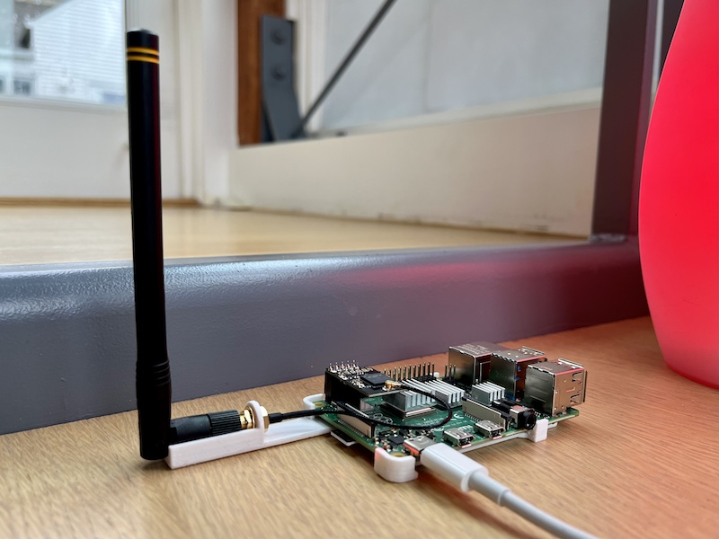

zwavecase - minimal case for Raspberry Pi 4 B+ with RaZberry 7 Pro
==================================================================

This is a minimalist base plate style case that fits a Raspberry Pi 4 B+ with
the [RaZberry 7 Pro](https://z-wave.me/products/razberry/) Z-wave shield which
comes with an integrated antenna. The case holds the antenna out from the body
and keeps the Raspberry Pi stable on a flat surface.

The repository includes OpenSCAD source (warning: pretty messy) and a printable
STL. It also includes a PrusaSlicer G-code for PETG.

License
-------

This design is licensed by
[Andrew Ho](https://zeuscat.com/andrew/) under the
[Creative Commons - Attribution license](https://creativecommons.org/licenses/by/4.0/).

The RaZberry Pro is sold by
[Smart Systems Distribution Sàrl](https://smartsd.ch/). This repository is not
related to endorsed by the latter.
